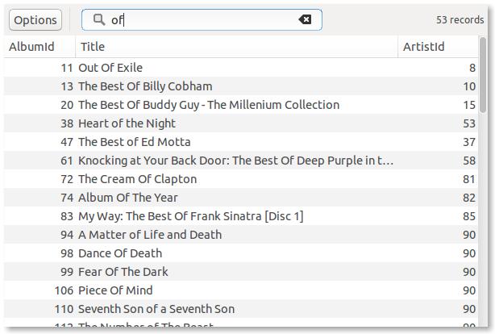
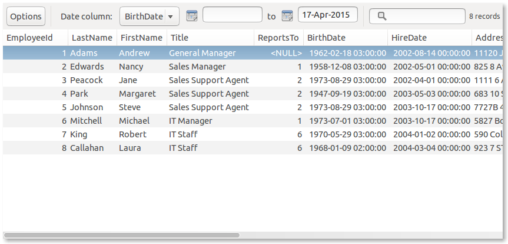
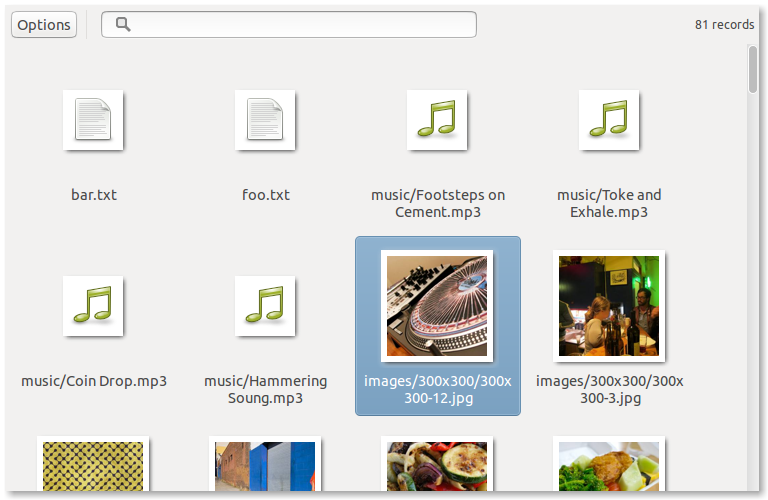
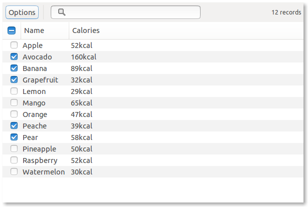

=============
datagrid_gtk3
=============

.. image:: https://semaphoreci.com/api/v1/projects/bd20f827-7591-4c58-87bb-e9235fdb9a0a/422070/shields_badge.svg
    :target: https://semaphoreci.com/nowsecure/datagrid-gtk3
    :alt: Test Results

.. image:: https://coveralls.io/repos/nowsecure/datagrid-gtk3/badge.svg
    :target: https://coveralls.io/r/nowsecure/datagrid-gtk3
    :alt: Test Coverage

.. image:: https://badge.fury.io/py/datagrid_gtk3.svg
    :target: http://badge.fury.io/py/datagrid_gtk3
    :alt: Latest PyPI Version

.. image:: https://landscape.io/github/nowsecure/datagrid-gtk3/master/landscape.svg?style=flat
    :target: https://landscape.io/github/nowsecure/datagrid-gtk3/master
    :alt: Code Health

SYNOPSIS
========

MVC framework for working with the Gtk3 TreeView widget.
Includes classes for file browsing and displaying SQLite databases.

MOTIVATION
==========

Created on the account of the reoccurring need to display and interact with
contents of SQLite databases in Gtk applications.

EXAMPLE
=======

The basic usage scenario looks like this:

.. code-block:: python

    win = Gtk.Window()

    data_source = SQLiteDataSource(db_path, table_name)
    datagrid_container = DataGridContainer(win)
    controller = DataGridController(datagrid_container, data_source)
    datagrid_container.grid_vbox.reparent(win)

    win.show()

For more advanced usages see the example applications in the "examples" folder.

"Chinook" example
-----------------

    Displaying a table from an SQLite database with text filtering.

    Displaying a table from an SQLite database with date range filtering.

"Filebrowser" example
---------------------

    Browsing the file system in icon view mode with thumbnails.

"Selectable" example
--------------------

    Persistent row selection in SQLite databases.
